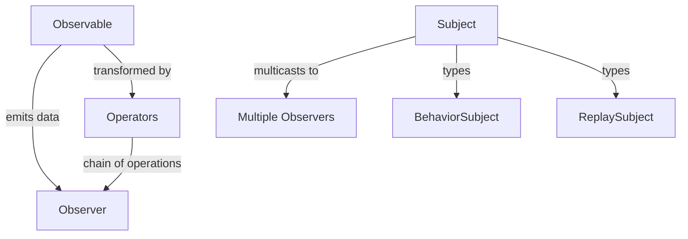
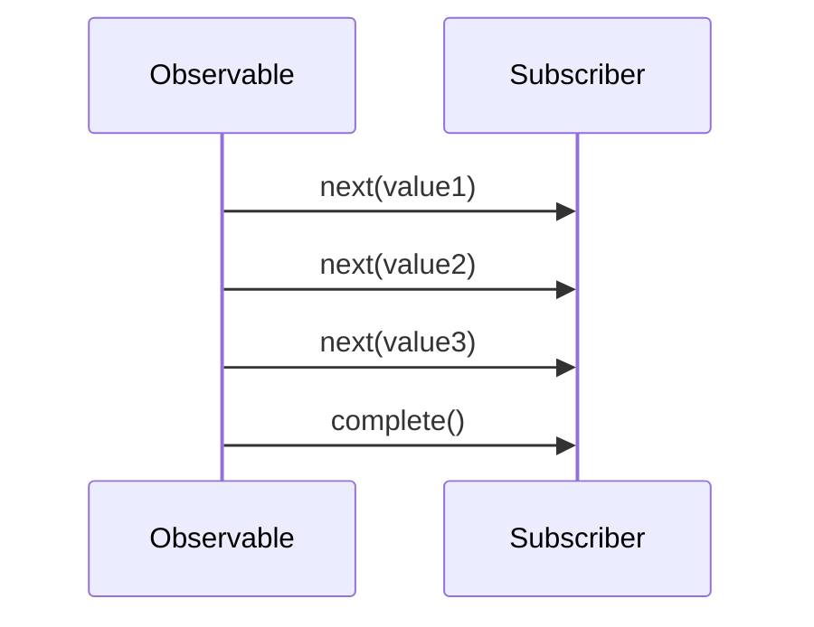
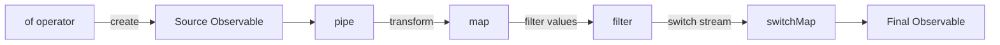
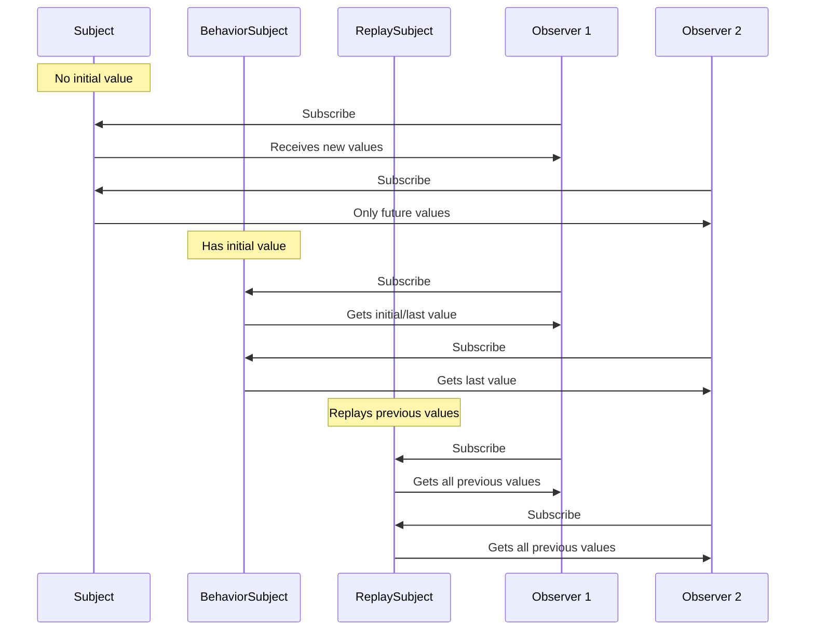

# RxJS in Angular
RxJS (Reactive Extensions for JavaScript) is a library for reactive programming using Observables, which makes it easier to compose asynchronous or callback-based code. In Angular, RxJS is used extensively for handling asynchronous operations, such as HTTP requests, event handling, and more.

## RxJS Overview



## Observable-Observer Pattern


## Key Concepts
- **Observables**: A data stream that can emit multiple values over time.
- **Observers**: Consumers of the data emitted by Observables.
- **Operators**: Functions that enable functional programming with Observables, allowing you to transform, filter, and combine streams.
- **Subjects**: A special type of Observable that allows values to be multicast to multiple Observers.

## Example calling an HTTP API
```typescript
import { HttpClient } from '@angular/common/http';
import { Injectable } from '@angular/core';
import { Observable } from 'rxjs';

@Injectable({
    providedIn: 'root'
})
export class ApiService {
    // 1. Inject HttpClient
    constructor(private http: HttpClient) {}

    // 2. Create a method that returns an Observable
    getData(): Observable<any> {
        return this.http.get('https://api.example.com/data');
    }
}

// In a component
import { Component, OnInit } from '@angular/core';
import { ApiService } from './api.service';

@Component({
    selector: 'app-example',
    templateUrl: './example.component.html',
    styleUrls: ['./example.component.css']
})
export class ExampleComponent implements OnInit {
    data: any;

    constructor(private apiService: ApiService) {}

    ngOnInit() {
        this.apiService.getData().subscribe(response => {
            this.data = response;
        });
    }
}
```
what is **.subscribe()**?
The `.subscribe()` method is used to subscribe to an Observable in RxJS. When you call `.subscribe()`, you are essentially telling the Observable to start emitting values, and you provide a callback function that will be executed each time a new value is emitted.
callback in `.subscribe()`
- **Next Callback**: This function is called whenever the Observable emits a new value. You can use this to handle the data received from the Observable. If we only provide one function to `.subscribe()`, it will be treated as the next callback.
- **Error Callback**: This function is called if the Observable encounters an error. You can use this to handle any errors that may occur during the data emission.
- **Complete Callback**: This function is called when the Observable has finished emitting all values. You can use this to perform any cleanup or finalization tasks.

```typescript
observable.subscribe({
    next: (value) => {
        // Handle the emitted value
    },
    error: (err) => {
        // Handle the error
    },
    complete: () => {
        // Handle the completion
    }
});
```
## Operators
RxJS provides a wide range of operators that allow you to manipulate and transform Observables.



- **Pipe Operator**: The `pipe` method is used to combine multiple operators into a single function. This allows you to create a chain of operations that will be applied to the Observable.
- **Map Operator**: The `map` operator is used to transform the values emitted by an Observable. It takes a function as an argument that defines how to transform each value.
- **Filter Operator**: The `filter` operator is used to filter the values emitted by an Observable. It takes a predicate function as an argument that defines which values should be emitted.
- **SwitchMap Operator**: The `switchMap` operator is used to switch to a new Observable whenever the source Observable emits a value. It is commonly used for handling HTTP requests that depend on previous values.
- **Of Operator**: The `of` operator is used to create an Observable that emits a sequence of values.

```typescript
import { map, filter } from 'rxjs/operators';

observable
.pipe(
    map((value) => value * 2),
    filter((value) => value > 10)    
).subscribe((value) => {
    // Handle the transformed value
});
```

SwitchMap example:
```typescript
import { switchMap } from 'rxjs/operators';

observable
.pipe(
    switchMap((id) => this.http.get(`api/user/${id}`)),
    switchMap((user) => {
        if (user.isActive) {
            return this.http.get(`api/user/${user.id}/details`);
        } else {
            return of(null); // Return an observable with null if user is not active
        }
    }),
).subscribe((details) => {
    console.log(details);// if user is not active, details will be null
});
```

## Subjects
Subjects are a special type of Observable that allows values to be multicast to multiple Observers. They can be used to create event emitters, manage state, and more.



- **Subject**: A Subject is an Observable that can also act as an Observer. It allows you to multicast values to multiple Observers.
- **BehaviorSubject**: A BehaviorSubject is an Observable that emits the **last value** emitted by the source Observable, or a default value if no values have been emitted yet.
- **ReplaySubject**: A ReplaySubject is an Observable that emits all values emitted by the source Observable, or a default value if no values have been emitted yet.

```typescript
import { Subject } from 'rxjs';
const subject = new Subject<number>();
const observerA = subject.subscribe((value) => {
    console.log('Observer A:', value);
});

subject.next(1);

const observerB = subject.subscribe((value) => {
    console.log('Observer B:', value);
});
subject.next(2);

ngOnDestroy() {
    // don't forget to unsubscribe to avoid memory leaks
    observerA.unsubscribe();
    observerB.unsubscribe();
}

// Output:
// Observer A: 1
// Observer A: 2
// Observer B: 2
```

```typescript
import { BehaviorSubject } from 'rxjs';
const behaviorSubject = new BehaviorSubject<number>(0); // initial value is 0
behaviorSubject.subscribe((value) => {
    console.log('Observer A:', value);
});

behaviorSubject.next(1);
behaviorSubject.next(2);
behaviorSubject.subscribe((value) => {
    console.log('Observer B:', value);
});
behaviorSubject.next(3);
// Output:
// Observer A: 0
// Observer A: 1
// Observer A: 2
// Observer B: 2
// Observer A: 3
// Observer B: 3
```